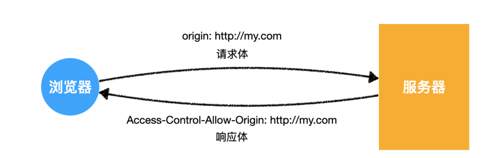

> 简单请求
> 需要预检的请求
> 附带身份凭证的请求


当浏览器发送一枚请求时，首先会判断这是什么类型的请求


## 简单请求

* 请求方法：GET、POST、HEAD
* 请求头仅包含安全的字段：accept、content-type等常规字段
* 请求头的content-type类型为以下三种
	* text/plain
	* multpart/form-data
	* application/x-www-form-urlencoded

简单请求

```js
fetch("http://crossdomain.com/api/news");

fetch("http://crossdomain.com/api/news", {
  method: "post"
})
```

非简单请求
```js
// 请求方法不满足要求，不是简单请求
fetch("http://crossdomain.com/api/news", {
  method:"PUT"
})

// 加入了额外的请求头，不是简单请求
fetch("http://crossdomain.com/api/news", {
  headers:{
    a: 1
  }
})

// content-type不满足要求，不是简单请求
fetch("http://crossdomain.com/api/news", {
  method: "post",
  headers: {
    "content-type": "application/json"
  }
})
```


### 简单请求的交互规范

当浏览器判断该枚请求为建档请求时，会进行如下补充

1. 请求头中自动添加origin字段
	一个简单请求：fetch("http://crossdomain.com/api/news");
	```http
	GET /api/news/ HTTP/1.1
	Host: crossdomain.com
	Connection: keep-alive
	...
	Referer: http://my.com/index.html
	Origin: http://my.com 
	```
	最后一条就是在告诉服务器，是哪个源地址在跨域请求

2. 服务器响应头中应包含`Access-Control-Allow-Origin`
	后端就是针对这个响应头设置相关配置，让浏览器把请求结果返回前端
	* 使用*，代表对所有访问者开放
	* 值设置为：http://my.com
	* [域名1，域名2，域名3]：设置白域名,需要使用代码做下处理



这样就完成了简单请求的跨域请求


## 需要预检的请求

简单的请求难以对服务器造成威胁，所以要求比较宽松

除了以上简单请求之外，浏览器就会走下面的流程

1. **浏览器发送预检请求，询问服务器是否允许**
    
2. **服务器允许**
    
3. **浏览器发送真实请求**
    
4. **服务器完成真实的响应**


客户端发送一枚会造成跨域的请求
```js
fetch("http://crossdomain.com/api/user", {
  method:"POST", // post 请求
  headers:{  // 设置请求头
    a: 1,
    b: 2,
    "content-type": "application/json"
  },
  body: JSON.stringify({ name: "袁小进", age: 18 }) // 设置请求体
});
```


## 附带身份凭证的请求
