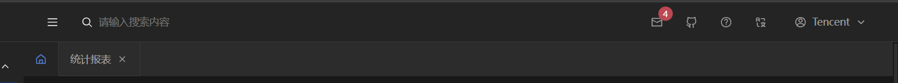

调色盘每种色系由深到浅10多种

## 基础调色盘

* 主题色
* 提示色
* 错误色
* 成功色
* 灰色
* 字体 - 白色
* 字体 - 灰色


## 语义化包装

只取一种

* 主题色：都是取调色盘的主题色， 这个主题色一般用作组件库的default
	* hover
	* focus
	* active
	* disabled
	* light
	* light-hover
* 提示色
	* hover
	* focus
	* active
	* disabled
	* light
	* light-hover
* 错误色：如上
* 成功色：如上
* 遮罩
	* active
	* disabled
* 页面：灰色系
* 容器
	* hover
	* active
	* select
* 次级容器：如上
* 组件：
	* hover
	* active
	* disabled
* 文字
	* 主色
	* 次色
	* placeholder
	* disabled
	* anti
	* brand
	* link
* 边框层级1
* 边框层级2
* 阴影1
* 阴影2
* 阴影3
* 阴影
	* inset-top
	* inset-right
	* inset-bottom
* 表格阴影
* 滚动条颜色
	* hover
	* track


## 设计思路

1. 感觉可以先设计语义化包装的需求，然后再搞调色盘
2. 以组件库为准的话，改动稍微小点，稳定点，不过使用自定义的颜色修改也还好


## 基于TDesign进行主题色开发

1. 自己搞个调色盘
2. 自己的模块自己维护

3. TDesign组件库的颜色，可以通过重写Tdesign的变量名修改


## 文件的覆盖与合并

```css
:root, :root[theme-mode="light"] {
    --td-brand-color-1: #f2f3ff;
    --td-brand-color-2: #d9e1ff;
    }
```

这个会将组件库的变量覆盖掉，注意加载顺序，用作于修改组件的变量样式


```css
/* 公共的 */
:root, :root[theme-mode="light"] {
	--td-brand-color-1: #f2f3ff;
	--td-brand-color-2: #d9e1ff;
}

/* 具体的的 */
:root, :root[theme-mode="light"] {
	--td-brand-color-11: #111;
	--td-brand-color-22: #222;
}
```

将公共部分抽到公共css代码块里，有些定制的写到另一个css代码块


## 认识


次级颜色的意思，看到两种颜色了么，不能使用同样的颜色
