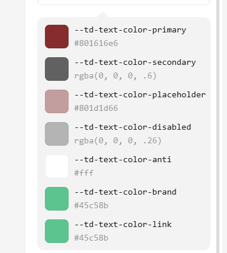

:root,指的是根元素，在html中就是html标签

:root[theme-mode='right'], 白天模式
:root[theme-color='#0052D9']，主题色为0052D9
[theme-color='#0052D9']：属性选择器，即 当标签上的属性为theme-color为#0052D9时，这个样式生效
``` html
<html lang='en' theme-mode="dark"></html>
```

```html
<!-- [href*="example.com"] 选择器 -->
<a href="https://example.com">主页</a>
```


## 主题五大配置项

* 色彩：
* 字体：改变字体预设的大小、预设变量的大小
* 尺寸：就是把预制的尺寸放大或者缩小
* 圆角：调整预制的圆角的大小
* 阴影：调整预制的阴影


色彩

选中一种颜色，然后生成这种颜色的同类色10种


字体



其他的也是这样可视化调整数值，然后生成配置文件